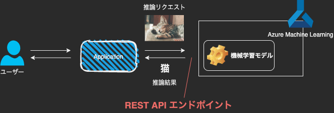

# Azure Machine Learning の使い方 (全体を理解するための入門編)

Date: 2021-04-14

---

## Azure Machine Learning とは

- 機械学習モデルのトレーニング、デプロイ、自動化、管理、追跡に使用できるクラウドベースの環境
- 類似サービスとしては、AWS の SageMaker や GCP の AI Platform がある


参考: [Azure Machine Learning とは](https://docs.microsoft.com/ja-jp/azure/machine-learning/overview-what-is-azure-ml)

---

## 機械学習 (Machine Learning: ML) とは

ざっくりいうと、、、入力データを元に、推論、予測をする


---

## AML のしくみ: アーキテクチャと概念


参考: https://docs.microsoft.com/ja-jp/azure/machine-learning/concept-azure-machine-learning-architecture

---

### ワークスペースと AML スタジオ

- 機械学習ワークスペースは、Azure Machine Learning の最上位レベルのリソース
- Azure Machine Learning スタジオから依存リソースを統合的に操作できる
- Azure Machine Learning スタジオとは、データサイエンティスト開発者向けの Web ポータル


参考: [Azure Machine Learning スタジオとは](https://docs.microsoft.com/ja-jp/azure/machine-learning/overview-what-is-machine-learning-studio?source=docs)

---

### コンピューティング先

- コンピューティング先は、トレーニング スクリプトを実行したり、サービスのデプロイをホストしたりするために使用するマシンまたはマシンのセット
- コンピューティング先として、ローカル コンピューターまたはリモート コンピューティング リソースを使用できる
- コンピューティング先を使用することにより、ローカル コンピューターでトレーニングを開始し、その後トレーニング スクリプトを変更することなくクラウドにスケールアウトできる


---

### AML のフルマネージド VM

Azure Machine Learning には、機械学習タスク用に構成された以下の 2 つのフル マネージド クラウドベース仮想マシン (VM) が導入されています。

- コンピューティング インスタンス:
  - 機械学習用にインストールされた複数のツールと環境を含む VM
  - 主な用途は、開発ワークステーション
  - 実態は VM なので、ssh ログインも可能
  - AML Studio もしくは SDK から作成が可能
  - トレーニング ジョブと推論ジョブのコンピューティング先としても使用可能
- コンピューティング クラスター:
  - マルチノード スケーリング機能を備えた VM のクラスター
  - 大規模なジョブと運用環境のコンピューティング先に適している
  - ジョブが送信されるときに自動的にスケールアップされる

---

#### コンピューティングインスタンス

- AML Studio で notebook を実行する際はコンピューティングインスタンスの起動が必要
- インスタンスは AML Studio もしくは SDK から作成が可能


---

#### コンピューティング クラスター

- モデルの学習や推論に利用
- 自動スケーリングの際の max node やインスタンスサイズ、VNET を指定可能
- クラスターは AML Studio もしくは SDK から作成が可能

python SDK から作成する例

```python
from azureml.core.compute import ComputeTarget, AmlCompute
from azureml.core.compute_target import ComputeTargetException

# Specify the configuration for the new cluster
compute_config = AmlCompute.provisioning_configuration(vm_size="STANDARD_D2_V3",
                                                        min_nodes=0,
                                                        max_nodes=4,
                                                        vnet_resourcegroup_name=vnet_resourcegroup_name,
                                                        vnet_name=vnet_name,
                                                        subnet_name=subnet_name)

# Create the cluster with the specified name and configuration
cpu_cluster = ComputeTarget.create(ws, cpu_cluster_name, compute_config)
```

---

#### サポートされているコンピューティング先

- Azure Machine Learning コンピューティング インスタンス
- Azure Machine Learning コンピューティング クラスター
- Azure Kubernetes Service クラスター
- ユーザーのローカル コンピューター
- リモート仮想マシン
- Azure HDInsight
- Azure Batch
- Azure Databricks
- Azure Data Lake Analytics
- Azure Container Instances

参考: [トレーニングと推論のコンピューティング先を設定する - Azure Machine Learning](https://docs.microsoft.com/ja-jp/azure/machine-learning/how-to-attach-compute-targets)

---

### データセットとデータストア

- Azure Machine Learning Datasets によって、データへのアクセスと操作がより容易になる
- データセットは、ローカル ファイル、パブリック URL、Azure Open Datasets、または Azure ストレージ サービスから、データストアを介して作成できる
- Azure Storage や DB をデータストアとして登録できる

---

### データセットとデータストア


参考: [クラウドでのデータ アクセスをセキュリティ保護する - Azure Machine Learning](https://docs.microsoft.com/ja-jp/azure/machine-learning/concept-data)

---

#### データストアとして登録可能なストレージ ソリューション

- Azure Blob Storage
- Azure File Share
- Azure SQL Database
- Azure PostgreSQL
- Azure Database for MySQL (制限あり)
- 他

参考: [Azure のストレージ サービスに接続する - Azure Machine Learning](https://docs.microsoft.com/ja-jp/azure/machine-learning/how-to-access-data)

---

Azure Blob Storage をデータストアとして登録する例

```python
from azureml.core.datastore import Datastore

batchscore_blob = Datastore.register_azure_blob_container(ws,
                      datastore_name="images_datastore",
                      container_name="sampledata",
                      account_name="pipelinedata",
                      overwrite=True)

def_data_store = ws.get_default_datastore()
```

---

### 環境

環境とは、機械学習モデルのトレーニングやスコアリングが行われる環境をカプセル化したものです。 環境では、トレーニングとスコアリングのスクリプトに関連する、Python パッケージ、環境変数、およびソフトウェア設定を指定します。

---

データストア、環境、コンピューティング先の関係


参考: [Training Python models on Azure - Azure Architecture Center](https://docs.microsoft.com/en-us/azure/architecture/reference-architectures/ai/training-python-models)

---

環境を作成する例

```python
from azureml.core import Environment
from azureml.core.conda_dependencies import CondaDependencies
from azureml.core.runconfig import DEFAULT_GPU_IMAGE

# イメージにはない python package の追加
cd = CondaDependencies.create(pip_packages=["tensorflow-gpu==1.15.2",
                                            "azureml-core", "azureml-dataset-runtime[fuse]"])

env = Environment(name="parallelenv")
env.python.conda_dependencies=cd
env.docker.base_image = DEFAULT_GPU_IMAGE  # 利用するコンテナイメージ
```

上記では、モデル実行に使用する container image、conda package (python library) を指定しています。

---

### 実験

実験は、モデル実行のグループです。 実験は、常に 1 つのワークスペースに属します。 実行を送信するときは、実験名を指定します。 実行に関する情報は、その実験に格納されます。 実験を送信するときに名前が存在しない場合は、新しい実験が自動的に作成されます。

実験の作成例

```python
from azureml.core import Experiment
experiment = Experiment(workspace=ws, name="diabetes-experiment")
```

参考: https://docs.microsoft.com/ja-jp/azure/machine-learning/concept-azure-machine-learning-architecture#experiments

---

機械学習における実験管理の概念


様々な条件を変えて実験を行い、モデルの性能を計測します。

参考: [What is automated ML? AutoML - Azure Machine Learning](https://docs.microsoft.com/en-us/azure/machine-learning/concept-automated-ml)

---

### モデル

モデルは、名前とバージョンによって識別されます。 既存のモデルと同じ名前でモデルを登録するたびに、レジストリではそれが新しいバージョンと見なされます。 バージョンはインクリメントされ、新しいモデルは同じ名前で登録されます。

参考: https://docs.microsoft.com/ja-jp/azure/machine-learning/concept-azure-machine-learning-architecture#model-registry

---

### ログ記録

Azure Machine Learning では、標準的な実行メトリックが自動的にログに記録されます。 ただし、Python SDK を使用して任意のメトリックをログに記録することもできます。

- Azure Storage に自動で保存される

---

### Azure Machine Learning パイプライン

- Azure Machine Learning パイプラインは、独立して実行できる完全な機械学習タスクのワークフロー
- サブタスクは、パイプライン内の一連のステップとしてカプセル化される
- 再実行する必要がないステップはスキップして、前回実行時のキャッシュを利用できる
- パイプラインでは、異なるタスクには異なるハードウェアを使用することを選択できる
- 中間データはダウンストリームのコンピューティング ターゲットへとシームレスに流れる
- パイプラインを発行した後は、任意のプラットフォームまたはスタックからパイプラインを再実行できる REST エンドポイントを構成できる
- 定時実行のスケジュールを設定することが可能

参考: [機械学習パイプラインとは - Azure Machine Learning](https://docs.microsoft.com/ja-jp/azure/machine-learning/concept-ml-pipelines)

---

パイプラインの例


参考: [チュートリアル:デザイナーを使用して自動車の価格を予測する - Azure Machine Learning](https://docs.microsoft.com/ja-jp/azure/machine-learning/tutorial-designer-automobile-price-train-score)

---

パイプラインのサブタスクを作成する例

```python
step02 = PythonScriptStep(name="step02",
                         script_name="./src/step02.py",
                         arguments=["--storage", dr_storage,
                                    "--date", str_date],
                         inputs=[dr_storage],
                         compute_target=aml_compute,
                         source_directory=source_directory,
                         runconfig=run_config_model,
                         allow_reuse=False)
```

---

順次的に実行するようにパイプラインを構築する例

```python
step02.run_after(step01)
step03.run_after(step02)
steps = [step03]
pipeline1 = Pipeline(workspace=ws, steps=steps)
```

並列に実行する場合

```python
steps = [step01, step02, step03]
pipeline1 = Pipeline(workspace=ws, steps=steps)
```

---

### エンドポイント

エンドポイントは、クラウドでホストできる Web サービスまたは統合デバイス デプロイ用 IoT モジュールへのモデルのインスタンス化です。

- Web サービス エンドポイント
- リアルタイム エンドポイント
- パイプライン エンドポイント
- IoT モジュール エンドポイント

参考: [アーキテクチャと主要な概念 - Azure Machine Learning](https://docs.microsoft.com/ja-jp/azure/machine-learning/concept-azure-machine-learning-architecture#endpoints)

---

#### Web サービス エンドポイント

- REST API エンドポイントを Azure Container Instances、Azure Kubernetes Service、または FPGA にデプロイできる
- 自動スケールを有効にしてある場合は、Azure でデプロイが自動的にスケーリングされる
- エンドポイントの監視ができる



参考: [アーキテクチャと主要な概念 - Azure Machine Learning](https://docs.microsoft.com/ja-jp/azure/machine-learning/concept-azure-machine-learning-architecture#web-service-endpoint)

---

#### Web サービス エンドポイント

HTTP 要求を送信して推論結果を得ることができる

```python
import requests

# send a random row from the test set to score
random_index = np.random.randint(0, len(X_test)-1)
input_data = "{\"data\": [" + str(list(X_test[random_index])) + "]}"

headers = {'Content-Type': 'application/json'}

# for AKS deployment you'd need to the service key in the header as well
# api_key = service.get_key()
# headers = {'Content-Type':'application/json',  'Authorization':('Bearer '+ api_key)}

resp = requests.post(service.scoring_uri, input_data, headers=headers)

print("POST to url", service.scoring_uri)
#print("input data:", input_data)
print("label:", y_test[random_index])
print("prediction:", resp.text)
```

参考: [イメージの分類チュートリアル:モデルをデプロイする - Azure Machine Learning](https://docs.microsoft.com/ja-jp/azure/machine-learning/tutorial-deploy-models-with-aml)

---

#### パイプライン エンドポイント

- REST エンドポイントを使用して、プログラムで ML パイプラインを呼び出し、パイプライン ワークフローを自動化できる
- 同じエンドポイントを使用して複数のパイプラインを管理し、バージョンを指定して呼び出すことができる

---

## 開発環境

- AML Studio だと SDK のインストールが不要
- [SDK のインストールによりローカルでの開発が可能](https://docs.microsoft.com/ja-jp/azure/machine-learning/tutorial-1st-experiment-sdk-setup-local)
- [VScode 拡張 (プレビュー版) が公式から提供されている](https://docs.microsoft.com/ja-jp/azure/machine-learning/tutorial-setup-vscode-extension)

---

## まとめ

- Azure Machine Learning を使うことで、機械学習モデルの開発、デプロイ、自動化、管理が容易になる


---

## 感想

- AML はプレビュー版の機能も多く、まだ成熟していない印象。今後さらに安定したサービスになることを期待
  - フィールドテスト運用中に、Azure 側の障害が 2 回あった
    - パイプラインの実行準備が何らかの理由で失敗
    - パイプラインのサブタスクのうち、1つが開始されず、ログやアラートも機能しなかった
- AML の良いと思うところ
  - パイプラインでサブタスクごとにインスタンススペックを指定でき、ジョブ数に応じたスケールアウトを自動化できる
  - 機械学習モデルのエンドポイントを、負荷分散可能な形で容易に作成できる

---

## 参考文献

- [Azure Machine Learning のドキュメント](https://docs.microsoft.com/ja-jp/azure/machine-learning/)
- [microsoft/MLOpsPython](https://github.com/Microsoft/MLOpsPython)
- [Azure/ACE_Azure_ML/slides](https://github.com/Azure/ACE_Azure_ML/tree/master/slides)
- [Azure Virtual Machine と MAC address - Qiita](https://qiita.com/hnishi/items/16bb2a41c622c52b427a)
